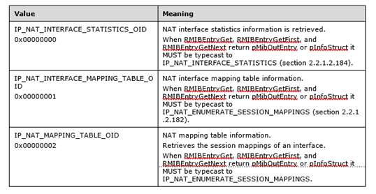

# [MS-RRASM]: Routing and Remote Access Server (RRAS) Management Protocol

<a href="https://msdn.microsoft.com/en-us/library/346fd520-ca12-4b5c-82d0-f920f2c81ea2">msdn link</a>

 

<table>
 <thead>
  <tr>
   <th>
   
This topic lists the Errata found in [MS-RRASM]
   since it was last published. Since this topic is updated frequently, we
   recommend that you subscribe to these RSS or Atom feeds to receive update
   notifications.

   
Errata are subject to the same terms as the
   Open Specifications documentation referenced.

   </th>
   <th>
   
<a href="http://blogs.msdn.com/b/protocol_content_errata/rss.aspx">RSS</a>
   

   
<a href="http://blogs.msdn.com/b/protocol_content_errata/atom.aspx">Atom</a>
   

   
 

   </th>
  </tr>
 </thead>
</table>

To view a PDF file of the errata for the previous versions
of this document, see the following ERRATA Archives:

July 18, 2016 - <a href="http://go.microsoft.com/fwlink/?LinkId=822549">Download</a>

Errata below are for Protocol Document Version <a href="https://docs.microsoft.com/en-us/openspecs/windows_protocols/ms-rrasm/a1e2840d-c9ff-4407-abf4-17aa6af34112">V23.0
– 2018/09/12</a>.

<table><thead>
  <tr>
   <th>
   
Errata Published*

   </th>
   <th>
   
Description

   </th>
  </tr>
 </thead><tbody><tr>
  <td>
  
2019/10/28

  </td>
  <td>
  
&#8203;&#8203;In Section 2.2.1.2.45,
  MIB_IPMCAST_OIF_STATS, changed dwIfNextHopIPAddr to dwNextHopAddr in the
  dwNextHopAddr field description.&#8203;

  
&#8203;

  
Changed from:&#8203;

  
...&#8203;

  
dwNextHopAddr: Specifies the address of the next hop
  that corresponds to dwOutIfIndex. The dwOutIfIndex and dwIfNextHopIPAddr
  members uniquely identify a next hop on point-to-multipoint interfaces, where
  one interface connects to multiple networks. Examples of point-to-multipoint
  interfaces include non-broadcast multiple-access (NBMA) interfaces, and the
  internal interface on which all dial-up clients connect. For Ethernet and
  other broadcast interfaces, specify zero (0). Also specify zero (0) for
  point-to-point interfaces, which are identified by only dwOutIfIndex.&#8203;

  
...&#8203;

  
&#8203;

  
Changed to:&#8203;

  
...&#8203;

  
dwNextHopAddr: Specifies the address of the next hop
  that corresponds to dwOutIfIndex. The dwOutIfIndex and dwNextHopAddr members
  uniquely identify a next hop on point-to-multipoint interfaces, where one
  interface connects to multiple networks. Examples of point-to-multipoint
  interfaces include non-broadcast multiple-access (NBMA) interfaces, and the
  internal interface on which all dial-up clients connect. For Ethernet and
  other broadcast interfaces, specify zero (0). Also specify zero (0) for
  point-to-point interfaces, which are identified by only dwOutIfIndex.&#8203;

  
...&#8203;

  
&#8203;&#8203;

  
In Section 2.2.1.2.130, PPP_PROJECTION_INFO_1, changed
  dwAuthenticatedData to dwAuthenticationData in the dwAuthenticationData field
  description.  &#8203;

  
&#8203;

  
Changed from:&#8203;

  
...&#8203;

  
dwAuthenticationData: The same as dwAuthenticatedData
  in PPP_LCP_INFO.&#8203;

  
...&#8203;

  
&#8203;

  
Changed to:&#8203;

  
...&#8203;

  
dwAuthenticationData: The same as dwAuthenticationData
  in PPP_LCP_INFO (see section 2.2.1.2.71).&#8203;

  
...&#8203;

  
&#8203;&#8203;

  
In Section 2.2.1.2.176, IGMP_MIB_GROUP_INFO, changed
  interface types RAS_SERVER to IGMP_IF_RAS_SERVER and RAS_CLIENT to
  IGMP_IF_RAS_CLIENT.&#8203;

  
&#8203;

  
Changed from:&#8203;

  
The IGMP_MIB_GROUP_INFO structure is used in the
  IGMP_MIB_IF_GROUPS_LIST (section 2.2.1.2.176) structure. If the interface is
  of type RAS_SERVER then the group membership of all the RAS clients is
  summarized, and the GroupUpTime and GroupExpiryTime is the maximum over all
  member RAS clients, while the V1HostPresentTimeLeft is set to 0. If the
  interface is of type RAS_CLIENT, the IpAddr is the next hop IP address of the
  RAS client. The membership is summarized over the RAS clients unless the
  IGMP_ENUM_FOR_RAS_CLIENTS_ID flag is set in Flags.&#8203;

  
...&#8203;

  
&#8203;

  
Changed to:&#8203;

  
The IGMP_MIB_GROUP_INFO structure is used in the
  IGMP_MIB_IF_GROUPS_LIST (section 2.2.1.2.175) structure. If the interface is
  of type IGMP_IF_RAS_SERVER then the group membership of all the RAS clients
  is summarized, and the GroupUpTime and GroupExpiryTime is the maximum over
  all member RAS clients, while the V1HostPresentTimeLeft is set to 0. If the
  interface is of type IGMP_IF_RAS_CLIENT, the IpAddr is the next hop IP
  address of the RAS client. The membership is summarized over the RAS clients
  unless the IGMP_ENUM_FOR_RAS_CLIENTS_ID flag is set in Flags.&#8203;

  
...&#8203;

  
&#8203;&#8203;

  
In Section 2.2.1.2.181, IP_NAT_MIB_QUERY, changed
  instances of RMIBGetEntryFirst to RMIBEntryGetFirst.&#8203;

  
&#8203;

  
Changed from:&#8203;

  
The IP_NAT_MIB_QUERY structure is used to retrieve
  Network Address Translator (NAT) information and is passed to the following
  methods:&#8203;

  
&#9679; RMIBEntryGet (section 3.1.4.30)&#8203;

  
&#9679; RMIBGetEntryFirst (section 3.1.4.31)&#8203;

  
&#9679; RMIBEntryGetNext (section 3.1.4.32)&#8203;

  
....&#8203;

  
Oid: This is an index of the NAT MIB. It MUST be one
  of the following values.&#8203;

  
 

  

  
&#8203;

  
Changed to:&#8203;

  
The IP_NAT_MIB_QUERY structure is used to retrieve
  Network Address Translator (NAT) information and is passed to the following
  methods:&#8203;

  
&#9679; RMIBEntryGet (section 3.1.4.30)&#8203;

  
&#9679; RMIBEntryGetFirst (section 3.1.4.31)&#8203;

  
&#9679; RMIBEntryGetNext (section 3.1.4.32)&#8203;

  
...&#8203;

  
Oid: This is an index of the NAT MIB. It MUST be one
  of the following values.&#8203;

  
 

  

  
&#8203;

  
&#8203;In Section 2.2.1.2.260, BGP_POLICY, changed
  eType value from MatchMaxPrefix to MatchMaxPrefixes. And changed eAttrType
  values ModifyLocalPref to NewLocalPref, ModifyNextHop to NewNextHop, and
  ModifyMed to NewMed.&#8203;

  
&#8203;

  
Changed from:&#8203;

  
...&#8203;

  
A BGP policy:&#8203;

  
&#9679; MUST NOT have more than one Match clause with
  eType in BGP_POLICY_MATCH set to MatchASNRange (0x3). &#8203;

  
&#9679; MUST NOT have more than one Match clause with
  eType in BGP_POLICY_MATCH set to MatchMaxPrefix (0x5).&#8203;

  
&#9679; MUST NOT have more than one modify Action
  clause with eAttrType in BGP_POLICY_MODIFY (section 2.2.1.2.259) set to
  ModifyLocalPref (0x3).&#8203;

  
&#9679; MUST NOT have more than one modify Action
  clause with eAttrType in BGP_POLICY_MODIFY set to ModifyNextHop (0x4).&#8203;

  
&#9679; MUST NOT have more than one modify Action
  clause with eAttrType in BGP_POLICY_MODIFY set to ModifyMed (0x5).&#8203;

  
&#9679; MUST have only one Action clause with bDeny in
  BGP_POLICY_ACTION set to TRUE when a Match clause with eType in
  BGP_POLICY_MATCH is specified as MatchMaxPrefix (0x5). &#8203;

  
Changed to:&#8203;

  
...&#8203;

  
A BGP policy:&#8203;

  
&#9679; MUST NOT have more than one Match clause with
  eType in BGP_POLICY_MATCH set to MatchASNRange (0x3). &#8203;

  
&#9679; MUST NOT have more than one Match clause with
  eType in BGP_POLICY_MATCH set to MatchMaxPrefixes (0x5).&#8203;

  
&#9679; MUST NOT have more than one modify Action
  clause with eAttrType in BGP_POLICY_MODIFY (section 2.2.1.2.258) set to
  NewLocalPref (0x3).&#8203;

  
&#9679; MUST NOT have more than one modify Action clause
  with eAttrType in BGP_POLICY_MODIFY set to NewNextHop (0x4).&#8203;

  
&#9679; MUST NOT have more than one modify Action
  clause with eAttrType in BGP_POLICY_MODIFY set to NewMed (0x5).&#8203;

  
&#9679; MUST have only one Action clause with bDeny in
  BGP_POLICY_ACTION set to TRUE when a Match clause with eType in
  BGP_POLICY_MATCH is specified as MatchMaxPrefixes (0x5). &#8203;

  
&#8203;In Section 3.1.4.44, RMprAdminServerSetInfo
  (Opnum 43), changed return value ERROR_REBOOT_REQUIRED to
  ERROR_SUCCESS_REBOOT_REQUIRED when the RRAS server completes the processing
  successfully. &#8203;

  
&#8203;

  
Changed from:&#8203;

  
...&#8203;

  
When processing this call, the RRASM server MUST do
  the following:&#8203;

  
...&#8203;

  
&#9679; If the RRAS server completes the processing
  successfully return either ERROR_SUCCESS or ERROR_REBOOT_REQUIRED&lt;316&gt;
  based on the impact of the configuration change as indicated by the RRAS
  server. Otherwise return the error status.&#8203;

  
...&#8203;

  
&#8203;

  
Changed to:&#8203;

  
...&#8203;

  
When processing this call, the RRASM server MUST do
  the following:&#8203;

  
...&#8203;

  
&#9679; If the RRAS server completes the processing successfully
  return either ERROR_SUCCESS or ERROR_SUCCESS_REBOOT_REQUIRED&lt;316&gt; based
  on the impact of the configuration change as indicated by the RRAS server.
  Otherwise return the error status.&#8203;

  
...&#8203;

  
&#8203;

  
&#8203;In Section 3.1.4.48, RMprAdminServerSetInfoEx
  (Opnum 47), changed return value ERROR_REBOOT_REQUIRED to
  ERROR_SUCCESS_REBOOT_REQUIRED when the RRAS server completes the processing
  successfully.&#8203;

  
&#8203;

  
Changed from:&#8203;

  
...&#8203;

  
When processing this call, the RRASM server MUST do
  the following:&#8203;

  
...&#8203;

  
&#9679; If the RRAS server completes the processing
  successfully, it MUST return either ERROR_SUCCESS,
  ERROR_REBOOT_REQUIRED&lt;321&gt;, or ERROR_RESTART_REQUIRED&lt;322&gt; based
  on the impact of the configuration change. Otherwise return the error
  status.&#8203;

  
...&#8203;

  
&#8203;

  
Changed to:&#8203;

  
...&#8203;

  
When processing this call, the RRASM server MUST do
  the following:&#8203;

  
...&#8203;

  
&#9679; If the RRAS server completes the processing
  successfully, it MUST return either ERROR_SUCCESS,
  ERROR_SUCCESS_REBOOT_REQUIRED&lt;321&gt;, or
  ERROR_RESTART_REQUIRED&lt;322&gt; based on the impact of the configuration
  change. Otherwise return the error status.&#8203;

  
...&#8203;

  
&#8203;

  
In Section 3.4.4.5 RasRpcSubmitRequest (Opnum 12),
  changed instances of GetDevConfig to GetDevConfigStruct when describing
  client behavior for the ReqType REQTYPE_GETDEVCONFIG. &#8203;

  
&#8203;

  
Changed from:&#8203;

  
...&#8203;

  
REQTYPE_GETDEVCONFIG&#8203;

  
Before calling the method, the client MUST set the
  GetDevConfig.size value to the size of the GetDevConfig.config buffer.&#8203;

  
If the returned GetDevConfig.retcode is set to
  ERROR_BUFFER_TOO_SMALL (0x0000025B), the buffer that was passed in was not
  big enough to hold the device configuration information. The client SHOULD
  again call the API with GetDevConfig.size set to the size of returned
  GetDevConfig.size.&#8203;

  
...&#8203;

  
&#8203;

  
Changed to:&#8203;

  
...&#8203;

  
REQTYPE_GETDEVCONFIG&#8203;

  
Before calling the method, the client MUST set the
  GetDevConfigStruct.size value to the size of the GetDevConfigStruct.config
  buffer.&#8203;

  
If the returned GetDevConfigStruct.retcode is set to
  ERROR_BUFFER_TOO_SMALL (0x0000025B), the buffer that was passed in was not
  big enough to hold the device configuration information. The client SHOULD
  again call the API with GetDevConfigStruct.size set to the size of returned
  GetDevConfigStruct.size.&#8203;

  
...&#8203;

  
&#8203;

  
In Section 7, Appendix B: Product Behavior, changed
  the return value ERROR_REBOOT_REQUIRED to ERROR_SUCCESS_REBOOT_REQUIRED in
  product behavior note &lt;316&gt; when the configuration change requires a
  reboot of the machine for the settings to be applied.&#8203;

  
&#8203;

  
Changed from:&#8203;

  
&lt;316&gt; Section 3.1.4.44: Windows will return the
  error value ERROR_REBOOT_REQUIRED when the configuration change requires a
  reboot of the machine for the settings to be applied. One such implementation
  requirement is when the number of ports configured is more than the maximum
  number of ports that the tunneling protocols are configured to support
  initially.&#8203;

  
&#8203;

  
Changed to:&#8203;

  
&lt;316&gt; Section 3.1.4.44: Windows will return the
  error value ERROR_SUCCESS_REBOOT_REQUIRED when the configuration change
  requires a reboot of the machine for the settings to be applied. One such
  implementation requirement is when the number of ports configured is more
  than the maximum number of ports that the tunneling protocols are configured
  to support initially.&#8203;

  
&#8203;

  
&#8203;

  
In this document, numerous editorial fixes have also
  been made, e.g., changed instances of &quot;Ipv6&quot; and &quot;IPv6&quot;
  to &quot;IPV6&quot;; changed instances of &quot;GetDevConfig&quot; to
  &quot;GetDevConfigStruct&quot;; updated hexadecimal syntax to USHORT 16-bit
  format; and also added section numbers to programming elements where applicable.&#8203;&#8203;&#8203;

  
&#8203;&#8203;

  
Sections updated:&#8203;&#8203;

  
2.2.1.2.103&#8203;

  
2.2.1.2.104   &#8203;

  
2.2.1.2.134&#8203;

  
2.2.1.2.136   &#8203;

  
2.2.1.2.156   &#8203;

  
2.2.1.2.158   &#8203;

  
2.2.2.2.79   &#8203;

  
2.2.5.1.1&#8203;

  
3.1.4.30  &#8203;

  
3.1.4.31 &#8203;

  
3.1.4.33 &#8203;

  
3.1.4.38 &#8203;

  
3.1.4.44 &#8203;

  
3.3.4.5   &#8203;

  
7 - the following product behavior notes were
  upated:&#8203;

  
&lt;266&gt;   &#8203;

  
&lt;268&gt;&#8203;

  
&lt;272&gt;  &#8203;

  
&lt;290&gt;   &#8203;

  
&lt;293&gt;&#8203;

  
&lt;298&gt;   &#8203;

  
&lt;305&gt;   &#8203;

  
&#8203;

  
&#8203;

  </td>
 </tr><tr>
  <td>
  
2019/10/28

  </td>
  <td>
  
In Section 2.2.1.2.37 MIB_IPMCAST_BOUNDARY, added
  names of dwStatus values in the table.

  
 

  
Changed from:

  
dwStatus: A status value that describes the current
  status of this entry in a mullticast forwarding entry (MFE) boundary table.

  
Value            Meaning

  
 

  
0x00000001   The entry has an active status.

  
 

  
0x00000002   The entry has a notInService status.

  
 

  
0x00000003   The entry has a notReady status.

  
 

  
0x00000004   The entry has a createAndGo status.

  
 

  
0x00000005   The entry has a createAndWait status.

  
0x00000006   The entry has a destroy status.

  
 

  
Changed to:

  
dwStatus: A status value that describes the current
  status of this entry in a multicast forwarding entry (MFE) boundary table.

  
Value         Meaning

  
 

  
ROWSTATUS_ACTIVE

  
 

  
0x00000001   The entry has an active status.

  
 

  
ROWSTATUS_NOTINSERVICE

  
 

  
0x00000002   The entry has a notInService status.

  
 

  
ROWSTATUS_NOTREADY

  
 

  
0x00000003   The entry has a notReady status.

  
 

  
ROWSTATUS_CREATEANDGO

  
 

  
0x00000004   The entry has a createAndGo status.

  
 

  
ROWSTATUS_CREATEANDWAIT

  
 

  
0x00000005   The entry has a createAndWait status.

  
 

  
ROWSTATUS_DESTROY

  
0x00000006   The entry has a destroy status.

  
 

  
Section 2.2.1.2.105 IPX_MIB_INDEX, added missing value
  3 in the table.

  
 

  
Changed from:

  
TableId: Specifies the type of table. Values MUST be
  one of the following values.

  
Value         Meaning

  
 

  
IPX_BASE_ENTRY

  
 

  
0x00000000   IPX base. See IPXMIB_BASE (section
  2.2.1.2.107).

  
 

  
IPX_INTERFACE_TABLE

  
 

  
0x00000001  IPX interface table. See
  IPX_INTERFACE (section 2.2.1.2.109).

  
 

  
IPX_DEST_TABLE

  
 

  
0x00000002   IPX destination table. See IPX_ROUTE
  (section 2.2.1.2.110).

  
 

  
IPX_SERV_TABLE

  
 

  
0x00000004   IPX service table. See IPX_SERVICE
  (section 2.2.1.2.121).

  
 

  
IPX_STATIC_SERV_TABLE

  
0x00000005   IPX static service table. See
  IPX_STATIC_SERVICE_INFO (section 2.2.1.2.95).

  
 

  
Changed to:

  
TableId: Specifies the type of table. Values MUST be
  one of the following values.

  
 

  
Value         Meaning

  
 

  
IPX_BASE_ENTRY

  
 

  
0x00000000   IPX base. See IPXMIB_BASE (section
  2.2.1.2.106).

  
 

  
IPX_INTERFACE_TABLE

  
 

  
0x00000001  IPX interface table. See
  IPX_INTERFACE (section 2.2.1.2.108).

  
 

  
IPX_DEST_TABLE

  
 

  
0x00000002   IPX destination table. See IPX_ROUTE
  (section 2.2.1.2.109).

  
 

  
IPX_STATIC_ROUTE_TABLE

  
 

  
0x00000003   IPX Static Route Table. See IPX_STATIC_ROUTE_INFO
  (section 2.2.1.2.93).

  
 

  
IPX_SERV_TABLE

  
 

  
0x00000004   IPX service table. See IPX_SERVICE
  (section 2.2.1.2.120).

  
 

  
IPX_STATIC_SERV_TABLE

  
0x00000005   IPX static service table. See
  IPX_STATIC_SERVICE_INFO (section 2.2.1.2.94).

  
 

  
Section 2.2.1.2.177 IGMP_MIB_GROUP_INFO, updated names
  of values in the introduction: RAS_SERVER to IGMP_IF_RAS_SERVER, RAS_CLIENT
  to IGMP_IF_RAS_CLIENT, and IGMP_ENUM_FOR_RAS_CLIENTS_ID  to
  IGMP_ENUM_FOR_RAS_CLIENTS.

  
 

  
Changed from: The IGMP_MIB_GROUP_INFO structure is
  used in the IGMP_MIB_IF_GROUPS_LIST (section 2.2.1.2.176)
  structure. If the interface is of type RAS_SERVER then the group membership
  of all the RAS clients is summarized, and the GroupUpTime and GroupExpiryTime
  is the maximum over all member RAS clients, while the V1HostPresentTimeLeft
  is set to 0. If the interface is of type RAS_CLIENT, the IpAddr is the next
  hop IP address of the RAS client. The membership is summarized over the RAS
  clients unless the IGMP_ENUM_FOR_RAS_CLIENTS_ID flag is set in Flags.

  
 

  
Changed to:

  
The IGMP_MIB_GROUP_INFO structure is used in the
  IGMP_MIB_IF_GROUPS_LIST (section 2.2.1.2.175) structure. If the
  interface is of type IGMP_IF_RAS_SERVER then the group membership of all the
  RAS clients is summarized, and the GroupUpTime and GroupExpiryTime is the
  maximum over all member RAS clients, while the V1HostPresentTimeLeft is set
  to 0. If the interface is of type IGMP_IF_RAS_CLIENT, the IpAddr is the next
  hop IP address of the RAS client. The membership is summarized over the RAS
  clients unless the IGMP_ENUM_FOR_RAS_CLIENTS_ID flag is set in Flags.

  
 

  
Section 2.2.1.2.178 IGMP_MIB_IF_STATS, in the
  LastQuerierChangeTime description changed member name from
  igmpInterfaceQuerier to QuerierIpAddr.

  
 

  
Changed from:

  
 

  
LastQuerierChangeTime: The number of seconds since
  igmpInterfaceQuerier was last changed.

  
 

  
Changed to:

  
LastQuerierChangeTime: The number of seconds since
  QuerierIpAddr was last changed.

  
 

  
Section 2.2.1.2.179 IGMP_MIB_GROUP_SOURCE_INFO_V3,
  added section. Adjusted references and reference numbers 2.2.1.2.180 to
  2.2.1.2.271 throughout to compensate for section number changes.

  
 

  
Changed from:

  
 

  
(missing section)

  
 

  
Changed to:

  
 

  
The IGMP_MIB_GROUP_SOURCE_INFO_V3 structure provides
  information about each source IP endpoint.

  
 

  
typedef struct _IGMP_MIB_GROUP_SOURCE_INFO_V3 {

  
 

  
    DWORD       Source;

  
 

  
    DWORD      
  SourceExpiryTime;

  
 

  
    DWORD       SourceUpTime;

  
 

  
    DWORD       Flags;

  
 

  
} IGMP_MIB_GROUP_SOURCE_INFO_V3,
  *PIGMP_MIB_GROUP_SOURCE_INFO_V3;

  
 

  
Source: IP endpoint address of a source.

  
 

  
SourceExpiryTime: The time, in seconds, that remains
  before source expires. Not valid for exclusion mode.

  
 

  
SourceUpTime: The time, in seconds since the source
  was up.

  
Flags: Reserved. This is unused and SHOULD be NULL, or
  MAY be set to 0x00000000.

  
 

  
Section 2.2.1.2.180 IGMP_MIB_GROUP_INFO_V3, for
  Sources array of IGMP_MIB_GROUP_SOURCE_INFO_V3 added reference to
  2.2.1.2.179.

  
 

  
Changed from:

  
 

  
NumSources: The number of entries of
  IGMP_MIB_GROUP_SOURCE_INFO_V3.

  
 

  
Sources: The IGMP_MIB_GROUP_SOURCE_INFO_V3 structure.

  
 

  
Changed to:

  
 

  
NumSources: The number of entries of
  IGMP_MIB_GROUP_SOURCE_INFO_V3.

  
Sources: The IGMP_MIB_GROUP_SOURCE_INFO_V3 structure
  (section 2.2.1.2.179).

  
 

  
6 Appendix A: Full IDL, moved location of struct
  IGMP_MIB_GROUP_SOURCE_INFO_V3 to before struct IGMP_MIB_GROUP_INFO_V3.

  
 

  
Changed from:

  
 

  
typedef struct _IPRIP_PEER_STATS {

  
 

  
    DWORD      
  PS_LastPeerRouteTag;

  
 

  
    DWORD      
  PS_LastPeerUpdateTickCount;

  
 

  
    DWORD      
  PS_LastPeerUpdateVersion;

  
 

  
    DWORD      
  PS_BadResponsePacketsFromPeer;

  
 

  
    DWORD      
  PS_BadResponseEntriesFromPeer;

  
 

  
} IPRIP_PEER_STATS, *PIPRIP_PEER_STATS;

  
 

  
typedef struct _IGMP_MIB_GROUP_SOURCE_INFO_V3 {

  
 

  
    DWORD       Source;

  
 

  
    DWORD      
  SourceExpiryTime;   //not valid for exclusion mode

  
 

  
    DWORD       SourceUpTime;

  
 

  
    DWORD       Flags;

  
 

  
} IGMP_MIB_GROUP_SOURCE_INFO_V3,
  *PIGMP_MIB_GROUP_SOURCE_INFO_V3;

  
 

  
typedef struct _IGMP_MIB_GET_INPUT_DATA {

  
 

  
    DWORD       TypeId;

  
 

  
    USHORT      Flags;

  
 

  
    USHORT      Signature;
   

  
 

  
    DWORD       IfIndex;

  
 

  
    DWORD      
  RasClientAddr;

  
 

  
    DWORD       GroupAddr;

  
 

  
    DWORD       Count;  

  
 

  
} IGMP_MIB_GET_INPUT_DATA, *PIGMP_MIB_GET_INPUT_DATA;

  
 

  
Changed to:

  
 

  
typedef struct _IGMP_MIB_GROUP_IFS_LIST {

  
 

  
    DWORD       GroupAddr;

  
 

  
    DWORD      
  NumInterfaces;

  
 

  
    BYTE      
   Buffer[1];

  
 

  
} IGMP_MIB_GROUP_IFS_LIST, *PIGMP_MIB_GROUP_IFS_LIST;

  
 

  
typedef struct _IGMP_MIB_GROUP_SOURCE_INFO_V3 {

  
 

  
    DWORD       Source;

  
 

  
    DWORD      
  SourceExpiryTime;   //not valid for exclusion mode

  
 

  
    DWORD       SourceUpTime;

  
 

  
    DWORD       Flags;

  
 

  
} IGMP_MIB_GROUP_SOURCE_INFO_V3,
  *PIGMP_MIB_GROUP_SOURCE_INFO_V3;

  
 

  
typedef struct _IGMP_MIB_GROUP_INFO_V3

  
 

  
{

  
 

  
    union {

  
 

  
        DWORD      
   IfIndex;

  
 

  
        DWORD      
  GroupAddr;

  
 

  
    };

  
 

  
    DWORD       IpAddr;

  
 

  
    DWORD       GroupUpTime;

  
 

  
    DWORD      
  GroupExpiryTime;

  
 

  
    DWORD       LastReporter;

  
 

  
    DWORD      
  V1HostPresentTimeLeft;

  
 

  
    DWORD       Flags;

  
 

  
    //v3 additions

  
 

  
    DWORD       Version;
  //1/2/3

  
 

  
    DWORD       Size;  
  //size of this struct

  
 

  
    DWORD      
  FilterType;//EXCLUSION/INCLUSION

  
 

  
    DWORD      
  V2HostPresentTimeLeft;

  
 

  
    DWORD       NumSources;

  
 

  
    //IGMP_MIB_GROUP_SOURCE_INFO_V3  
     Sources[0];

  
 

  
} IGMP_MIB_GROUP_INFO_V3, *PIGMP_MIB_GROUP_INFO_V3;

  </td>
 </tr></tbody></table>

*Date format: YYYY/MM/DD

                