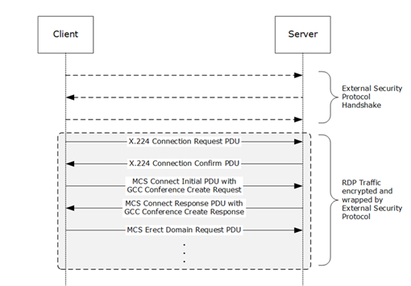

# [MS-FSCC]: File System Control Codes

<a href="https://msdn.microsoft.com/en-us/library/47d52c31-2fa8-4992-91eb-7617117a2214">msdn link</a>

 

<table>
 <thead>
  <tr>
   <th>
   
This topic lists the Errata found in the MS-FSCC
   document since it was last published. Since this topic is updated
   frequently, we recommend that you subscribe to these RSS or Atom feeds to
   receive update notifications.

   
Errata are subject to the same terms as the
   Open Specifications documentation referenced.

   </th>
   <th>
   
<a href="http://blogs.msdn.com/b/protocol_content_errata/rss.aspx">RSS</a>
   

   
<a href="http://blogs.msdn.com/b/protocol_content_errata/atom.aspx">Atom</a>
   

   
 

   </th>
  </tr>
 </thead>
</table>

To view a PDF file of the errata for the previous versions
of this document, see the following ERRATA Archives:

October 16, 2015 - <a href="http://go.microsoft.com/fwlink/?LinkID=690377">Download</a>

June 30, 2015 - <a href="http://go.microsoft.com/fwlink/?LinkId=617579">Download</a>

July 18, 2016 - <a href="http://go.microsoft.com/fwlink/?LinkId=822549">Download</a>

June 1, 2017 - <a href="https://winprotocoldoc.blob.core.windows.net/productionwindowsarchives/MS-WINERRATA/%5bMS-WINERRATA%5d-170601.pdf">Download</a>

September 15, 2017 - <a href="https://winprotocoldoc.blob.core.windows.net/productionwindowsarchives/MS-WINERRATA/%5bMS-WINERRATA%5d-170915.pdf">Download</a>

December 1, 2017 - <a href="https://winprotocoldoc.blob.core.windows.net/productionwindowsarchives/MS-WINERRATA/%5bMS-WINERRATA%5d-171201.pdf">Download</a>

September 12, 2018 - <a href="https://winprotocoldoc.blob.core.windows.net/productionwindowsarchives/MS-WINERRATA/%5bMS-WINERRATA%5d-180912.pdf">Download</a>

Errata below are for Protocol Document Version <a href="https://msdn.microsoft.com/en-us/library/cc231987.aspx">V45.0 –
2018/09/12</a>.

<table><thead>
  <tr>
   <th>
   
Errata Published*

   </th>
   <th>
   
Description

   </th>
  </tr>
 </thead><tbody><tr>
  <td>
  
2019/08/05

  </td>
  <td>
  
In Section 2.3.42, FSCTL_QUERY_FILE_REGIONS Reply, the
  length of the Region field has been changed from 24 bytes to variable.

  </td>
 </tr><tr>
  <td>
  
2019/08/05

  </td>
  <td>
  
In Section 2.3.41, FSCTL_QUERY_FILE_REGIONS Request, a
  new Reserved field has been added to the end of the data element.

  
 

  
Added:

  
 

  
Reserved (4 bytes): A 32-bit unsigned integer that is
  reserved. This field SHOULD be 0x00000000 and MUST be ignored.

  </td>
 </tr><tr>
  <td>
  
2019/08/05

  </td>
  <td>
  
In Section 2.3.41, FSCTL_QUERY_FILE_REGIONS Request,
  new product behavior notes have been added to
  FILE_REGION_USAGE_VALID_CACHED_DATA and
  FILE_REGION_USAGE_VALID_NONCACHED_DATA.

  
 

  
Added:

  
 

  
&lt;30&gt; Section 2.3.41:  This region usage flag can
  only be specified for volumes using the NTFS file system.

  
&lt;31&gt; Section 2.3.41:  This region usage flag can
  only be specified for volumes using the ReFS file system.

  
 

  
In Section 2.3.42.1, FILE_REGION_INFO, the
  DesiredUsage field has been changed from:

  
 

  
DesiredUsage (4 bytes): A 32-bit unsigned integer that
  indicates the usage for the given region of the file. The valid values are
  defined in section 2.3.41.

  
 

  
Changed to:

  
 

  
DesiredUsage (4 bytes): A 32-bit unsigned integer that
  indicates the usage for the given region of the file.

  <table><thead>
    <tr>
     <th>
     
Value 

     </th>
     <th>
     
Meaning

     </th>
    </tr>
   </thead><tbody><tr>
    <td>
    
0x00000000 

    </td>
    <td>
    
The given range is invalid. It does not match the
    criteria of the requested DesiredUsage as specified in section 2.3.41.

    </td>
   </tr><tr>
    <td>
    
FILE _USAGE_VALID_CACHED_DATA 0x00000001 

    </td>
    <td>
    
Defines those regions of the file that exists before
    VDL as it exists in the cache manager.&lt;32&gt;

    </td>
   </tr><tr>
    <td>
    
FILE _USAGE_VALID_NONCACHED_DATA 0x00000002 

    </td>
    <td>
    
Defines those regions of the files that exist before
    VDL on the storage device.&lt;33&gt;

    </td>
   </tr></tbody></table>
  
 

  
 

  
&lt;32&gt; Section 2.3.42.1:  The NTFS file system is
  the only file system that returns this region usage value.

  
&lt;33&gt; Section 2.3.42.1:  The ReFS file system is
  the only file system that returns this region usage value.

  </td>
 </tr><tr>
  <td>
  
2018/12/10

  </td>
  <td>
  
In Section 2.1.5, Pathname, the following has been
  removed:

  
 

  
&#9679;    Each pathname component MUST be no more
  than 255 characters in length. 

  
 

  
In Section 2.1.5.2, Filename, the following has been
  added:

  
 

  
&#9679;    A filename MUST be at least one character
  but no more than 255 characters in length. 

  
 

  
In Section 2.1.5.3, Streamname, the following has been
  added:

  
 

  
&#9679;    A streamname MUST be no more than 255
  characters in length.

  </td>
 </tr><tr>
  <td>
  
2018/12/10

  </td>
  <td>
  
In Section 2.3.9.2, SMB2_DUPLICATE_EXTENTS_DATA_EX, a
  new field called Reserved has been added to the packet diagram and the field
  descriptions. 

  
 

  
Added:

  
 

  
Reserved (4 bytes): This field SHOULD be set to zero
  and MUST be ignored.

  </td>
 </tr><tr>
  <td>
  
2018/11/12

  </td>
  <td>
  
In the sections listed below, the description of the
  EaSize field has been changed.

  
 

  
Section 2.4.8, FileBothDirectoryInformation

  
Section 2.4.14, FileFullDirectoryInformation

  
Section 2.4.17, FileIdBothDirectoryInformation

  
Section 2.4.18, FileIdFullDirectoryInformation

  
 

  
Changed from:

  
 

  
EaSize (4 bytes): A 32 -bit unsigned integer that
  contains the combined length, in bytes, of the extended attributes (EA) for
  the file.

  
 

  
Changed to:

  
 

  
EaSize (4 bytes): If FILE_ATTRIBUTE_REPARSE_POINT is
  set in the FileAttributes field, this field MUST contain a reparse tag as
  specified in section 2.1.2.1. Otherwise, this field is a 32 -bit unsigned
  integer that contains the combined length, in bytes, of the extended
  attributes (EA) for the file.,

  </td>
 </tr><tr>
  <td>
  
2018/11/12

  </td>
  <td>
  
In Section 2.4, File Information Classes, the
  following has been added:

  
 

  <table><thead>
    <tr>
     <th>
     
File information class

     </th>
     <th>
     
Level

     </th>
     <th>
     
Uses

     </th>
    </tr>
   </thead><tbody><tr>
    <td>
    
…

    </td>
    <td>
    
…

    </td>
    <td>
    
…

    </td>
   </tr><tr>
    <td>
    
FileIdInformation

    </td>
    <td>
    
59

    </td>
    <td>
    
Query&lt;78&gt;

    </td>
   </tr><tr>
    <td>
    
…

    </td>
    <td>
    
…

    </td>
    <td>
    
… 

    </td>
   </tr></tbody></table>
  
 

  
&lt;78&gt; Section 2.4:  The FileIdInformation information
  class is supported in the NTFS and ReFS file systems in Windows 8 and
  subsequent and Windows Server 2012 and subsequent.

  
 

  
The following new section has been added:

  
 

  
Section 2.4.43    FileIdInformation

  
This information class is used to query the volume
  serial number and fileid information for a file.

  
A FILE_ID_INFORMATION data element, defined as
  follows, is provided by the server.

  

  
VolumeSerialNumber (8 bytes): A 64-bit unsigned
  integer that contains the serial number of the volume where the file is
  located.

  
FileId (16 bytes): An opaque 128-bit signed integer
  that is an identifier of the file. For file systems that support file
  identifiers that are less than 128 bits, the unsupported portions of this
  value MUST be set to zero.&lt;121&gt;

  
This operation returns a status code as specified in
  section 2.2. Upon success, the status code returned by the function that
  processes this file information class is STATUS_SUCCESS. The most common
  error codes are listed in the following table.

  <table><thead>
    <tr>
     <th>
     
Error Code

     </th>
     <th>
     
Meaning

     </th>
    </tr>
   </thead><tbody><tr>
    <td>
    
STATUS_INFO_LENGTH_MISMATCH 0xC0000004

    </td>
    <td>
    
The specified information record length does not
    match the length that is required for the specified information class. 

    </td>
   </tr></tbody></table>
  

  </td>
 </tr></tbody></table>

*Date format: YYYY/MM/DD

                